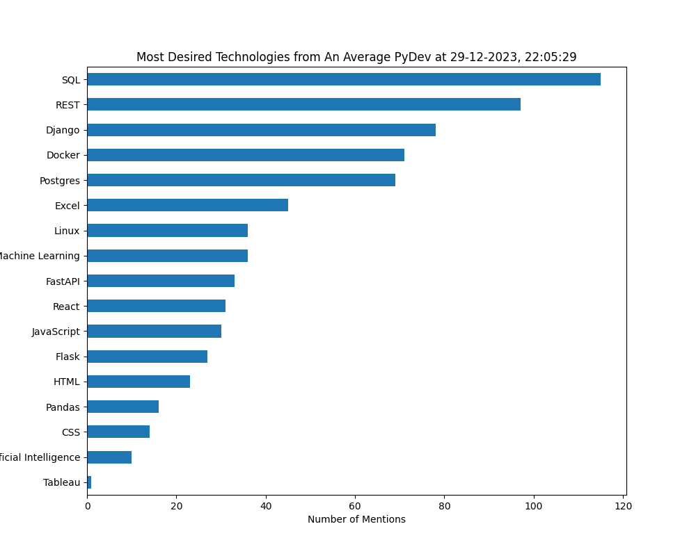

# Djinni python vacancies analyst

This is the ultimate Djinni scraper & analyser considering python positions.

## Usage

### Install required packages
```angular2html
pip install -r requirements.txt
```
### Scrape the site (choose criteria to analyze in config.py.COLUMNS)
```angular2html
python scraper.py
```
### Wow, look at these prints!

### Draw figures
Go to ```djinni_analisys.ipynd``` and run the first two cells and then whatever and how you want!

## Example

